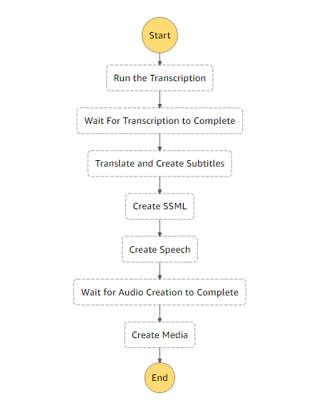
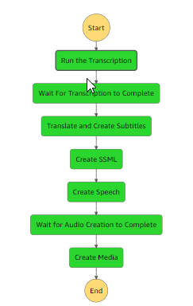
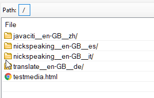

# Deploying a Video Transcoding Application

In this exercise, you will deploy a Serverless application that will allow you to upload a video and the application will dub the video with a new audio file in a different language, and also add the subtitles.

The application works using exclusively AWS AI based services, specifically:

The application uses the following AWS services
1. Amazon S3
2. Amazon Lambda
3. Amzon Transcribe
5. Amazon Translate
4. Amazon Polly
5. Amazon Media Encoder
6. StepFunctions

To see an example of what it does, view these two videos. This is an input video:

https://s3.us-east-1.amazonaws.com/transcribe.input.conygre.com/nickspeaking__en-GB__fr.mp4


And now here is a translated version of the same video now in French:

https://s3.us-east-1.amazonaws.com/transcribe.output.conygre.com/testmedia.html


The core of it is a StepFunction based pipeline that runs through a series of Lambda functions which complete the following tasks:

1. Take a video as an input
2. Translate the text into a different language
3. Add subtitles in the different language
4. Generate an AI based voice to dub the video with
5. Create a new version of the video with the subtitles and voice spoken in a different language

# Your Tasks
Broadly, you will need to complete the following tasks.

1. Get the project into your own Git repository.
2. Set up a CodeBuild Project that will deploy it for you.
3. Set up the necessary roles and permissions to allow the above to run successfully.


## 1. Get the Project into your own Git Repository

1. Login to your Cloud9 Development environment, and the use the following command at the terminal to clone the repository containing all the code:
 
```
git clone https://github.com/nicktodd/video-translation-stepfunctions.git
```

2. Using the AWS Console, create a Git Repository in Code Commit or use Github if you prefer, and then clone that repository as well into your Cloud9 environment.

4. Using the File explorer in Cloud9, copy all the files from the sample project to your empty Git repository folder.

5. CD into your new repository, and add the files to your Git and push them. This can be done using:

```
git add *
git commit -m "Initial Commit"
git push
```

### Create a Bucket for your Videos

1. Visit the S3 service in the AWS console.

2. Click the `Create Bucket` button.

3. At the `General Configuration`, enter a name for your bucket. Make a note of the name that you use and make sure you follow the AWS naming rules (described on the page)

4. Set the region to the eu-west-1.

5. Deselect the `Block All Public Access` checkbox and then select the acknowledgement box about 'objects might be public'.

6. Leave all the other options as they are and click `Create Bucket`. If you get any errors about your bucket name, fix those and try again.


## 2. Review the buildspec.yml

From now on, work in your Git project. If you are in Cloud9, whenever you see a reference to your preferred editor, then that will be your Cloud9 environment.

1. Expand your new Git project, and using your preferred editor, open the `buildspec.yml` file.

2.  There is very little in here, since the application has been configured to build and deploy using the AWS Serverless Application Model or SAM. 

```
version: 0.2
phases:
  build:
    commands:
      - echo Build started on `date`
      - sam build 
      - sam deploy --no-confirm-changeset
```

3. As you can see, the file is really just running two commands. One to build the project and a second to deploy the project.

You will see how the project is configured next.

## 3. Review the Lambda Functions

1. Using your preferred environment, expand the `functions` folder and you will see five Lambdas each in a dedicated folder.

2. To explore the AWS Transcribe service, open lambda1_s3_trigger_transcription\lambda_function.py.

3. The critical line is around line 37 where a transcription job is launched.

```
transcribe.start_transcription_job(
        TranscriptionJobName=job_name,
        Media={'MediaFileUri': job_uri},
        MediaFormat='mp4',
        LanguageCode=original_language_code,
        OutputBucketName=output_bucket_name
        )
```

4. You can see how the job takes in a number of parameters around language, video file location and format and so on.

5. The output generated is in a JSON format. An example of which can be seen in the sample_output folder. See `samples\2012311511nickspeaking__en-GB__es.json`.

6. The second Lambda is going to convert that JSON format into a standard subtitle format and also translate the text. Open `lambda2_json_to_srt\lambda_function.py`.

7. Locate the function `translate_text` around line 22. You can see the key line using the translate service:

```
result = translate.translate_text(Text=text, 
            SourceLanguageCode=source_language_code, TargetLanguageCode=target_language_code)
```

8. This Lambda also generates the SRT subtitle file. You can review a sample here: `samples\2012311511nickspeaking__en-GB__es_translated.srt`.

9. The third Lambda is now generating a file that can be processed by Polly which is the Amazon speech service. Open `lambda3_srt_to_ssml\lambda_function.py`

10. The format for the input required by Polly is  Speech Synthesis Markup Language (SSML). The code here is not using any AI, but a helper class called AmazonSpeech that can be used to add in the AWS specific entries into SSML. You can review a sample of the SSML in the samples folder. Open `samples\2012311511nickspeaking__en-GB__es_translated.ssml` to see what the format looks like.

11. Now you will open the fourth Lambda to review the code that will generate the synthesised speech using the AWS Polly service. Open `functions\lambda4_ssml_to_speech_Polly\lambda_function.py`. 

12. The key line that is doing the Polly speech generation is around line 46:

```
response = polly.start_speech_synthesis_task(
        OutputFormat='mp3',
        OutputS3BucketName=output_bucket_name,
        Text=ssml,
        OutputS3KeyPrefix=base_filename_ssml,
        TextType ='ssml',
        VoiceId=voiceid_list[target_language_code]    
    )
```
13. The fifth and final function can be located here: `functions\lambda5_mediaconvert\lambda_handler.js`.  The role of this function is to trigger the MediaEncoder service that will create our final video outputs. This one is written in JavaScript largely because the request parameter is a large JSON object which is easier to pass in from a JavaScript function. If you take a look a the code you will see what is meant!

| :zap:        These final steps involve some changes to the code!   |
|--------------------------------------------------------------------|
14. You do need to update one line of code in this Lambda. If you locate line 31 where the MediaConvert endpoint is located. This endpoint is unique per account and region. You need to change this to the endpoint for your AWS Account. To find the URL, using the Amazon Web console, navigate to the MediaConvert service, and click on  `Account`. Ensure you are in the eu-west-1 region, and then copy the API Endpoint to the clipboard. 

15. Replace the endpoint in the code with the one you have copied and save your changes.

16. Finally, towards the end of the Lambda function code, you will see a reference to a Role and Queue (lines 313-314). These two values include an account number and one of them includes a region. Edit the region name to be `eu-west-1` and edit the account number to be your AWS account number. The role name and queue that are being referenced will be available within the account you are using. To find the account number, in the AWS console, click on the top right drop down menu that contains your username. The account number is located there.

## 4. Review the StepFunctions Flow

The Step Function flow is as follows:



In order to create the flow a JSON file is used to configure each stage. 

1. Open `statemachine\video-transcode.asl.json`. This is the StepFunction file.

2. Note the basic structure of the file. There is a StartAt entry towards the top, specifying which state is first, and then we have a series of states. Each state refers to a LambdaARN (more on that later) and each state has a Next state. For example, here is the first state:

```
"Run the Transcription": {
  "Type": "Task",
  "Resource": "${TranscriptionFunctionArn}",
  "Retry": [
    {
      "ErrorEquals": [
          "States.TaskFailed"
      ],
      "IntervalSeconds": 15,
      "MaxAttempts": 2,
      "BackoffRate": 1.5
    }
  ],
  "Next": "Wait For Transcription to Complete"
},
```
3. Note too that there are two waits built into the flow. This is so that there is enough time for the transcription and audio file generation to complete. 
```
 "Wait For Transcription to Complete": {
       "Type": "Wait",
       "Seconds": 120,
       "Next": "Translate and Create Subtitles"
     },
```
These could be done in a more sophisticated way with a Lambda checking for the completion of the task. For now, they simply put in a two minute delay.

So how do the lambdas get deployed, how do we get hold of their dependencies, and how do we get those Lambda ARNs in to the Step functions. This is all handled by the Serverless Architecture Model (SAM).

We will take a look at that next.

## 5. Review and Edit the SAM Deployment File

So far, you have not needed to make any changes. However, you will here. This is the file that configures the deployment. 

1. Using your preferred editor, open `template.yaml`.

The format is very similar to CloudFormation templates, and you can see that it defines the various functions that will be deployed, and also some environment variables that are used by the functions to know which buckets to use for the various output files.

2. The `Globals` section can be used for values that are the same for all resources. You will need to specify six buckets and you will need to create those buckets in your AWS account (or simply point them all to one bucket if you prefer). 
  
Make sure you create any buckets in the same region as where you are deploying the application - eg. eu-west-1. Deselect the `Block all public access` option when you create the buckets. 

There is no need to make the buckets themselves public, but we will want to make some individual files public later on.

3. The `Resources` section then defines all the Lambdas, the StateMachine (step functions), and each Lambda is being assigned a LambdaInvoke policy.


| :zap:        Some more changes here!   |
|----------------------------------------|

4. You will notice multiple bucket environment variables throughout the file. Edit all of them to point to your bucket. Each lambda has an INPUT_BUCKET and an OUTPUT_BUCKET and there are a list of buckets at the top as well. The application supports using different buckets for the various steps, but for simplicity you can use the same one for everything, so for example, you will need to change lines 13-18 to something like where `example.video.bucket` would be your bucket name:

```
SOURCE_VIDEO_BUCKET: example.video.bucket
TRANSCRIBED_TEXT_BUCKET: example.video.bucket
TRANSLATED_SUBTITLES_BUCKET: example.video.bucket
SSML_BUCKET: example.video.bucket
POLLY_AUDIO_BUCKET: example.video.bucket
FINAL_OUTPUT_BUCKET: example.video.bucket
```


5. When you run SAM deploy at the command line, it creates a convenient file that allows you to set all of the default options. Since we are running SAM using CodeBuild, we will need to edit this file. Open the file `samconfig.toml`. 

```
version = 0.1
[default]
[default.deploy]
[default.deploy.parameters]
stack_name = "video-transcoder"
s3_bucket = "my-s3-bucket"
s3_prefix = "video-transcoder-nt"
region = "eu-west-1"
confirm_changeset = true
capabilities = "CAPABILITY_IAM"
```

6. Check that the region is set to `eu-west-1`. If not, change it. 

7. Another entry is the S3 bucket. This is used to put the zip files for all the Lambdas ready for deployment. Edit this value to be your bucket that you have created for the lab. 

8. Finally also change the stack name so it is unique. Perhaps put your initials in front of the name.

9. Save your changes.

10. Commit and push your changes to git.

```
git add *
git commit -m "Made my final modifications"
git push
```

## 6. Addressing the Permissions

You will have noticed that all of the Lambdas have the same policy applied to them called S3_Transcribe_Policy.

To keep it more straightfoward, we have created one policy with the relevant permissions required for all the Lambdas to execute the various functions. You could in theory have a different policy for each Lambda which would be better for the least privilege principle. 

1. The `S3_Transcribe_Policy` is located here: [IAM Policy](iam_policy_examples/s3_transcribe_policy.json). Check that this policy exists in your AWS account. If it does not, check with your instructor, as someone in your group will need to create it, but only one of you! 

## 7. Set up the CodeBuild Project

1. Using the `AWS Web Console`, navigate to the `CodeBuild` service.

2. Click `Create Build Project`. Set the name to be `[YourInitials]-VideoTranscriberBuild`. For the `Source`, link the project to your Git repository that you created earlier in step 1.

3. For the `Environment`, this is where you select the Docker image that will be used to complete your build. We need the latest version of the standard Amazon Linux for x86_64 processors. Make sure you DO NOT pick ARM which is arch64 as it looks very similar, but if you select it your build will take a very long time to complete.

4. Select that you would like to create a Service role.

5. For the Buildspec, you can use the default which is to use a buildspec.yml file in the root of the project. That file is already there.

6. The rest can be left as defaults, so you can simply select `Create build project`.

7. To set up the permissions, select `Build Details` for your new CodeBuild project, and then scroll down and click on the Service Role. Now click `Attach Policies`. Add the following Policies:

  * AmazonS3FullAccess - so it can access both the S3 bucket for codebuild artifacts
  * AWSCloudFormationFullAccess - so it can run your cloudformation template
  * CloudWatchLogsFullAccess - so you can see the log files
  * IAMFullAccess - so it can create the necessary policies for the lambdas
  * StepFunctionsFullAccess - to create the Stepfunctions
  * CodeCommitFullAccess - so it can access your source code
  * AWSLambda_FullAccess - so it can deploy the Lambda functions
  

## 8. Run the CodeBuild Project

1. In your CodeBuild project, click `Run Build`. It will take a while to complete, and you can see the logs as the build progresses.

2. If it works, you will find a new deployment in CloudFormation and if you visit the Step Function service, you will see your new Step functions.

If it has failed, check the logs in the CodeBuild project to identify the reason for the failure. The most likely cause will be insufficient permissions. Check your IAM policy and rerun. 

Cloudformation failures. If it managed to get started in the creation of the CLoudformation deployment, but fails partway for some reason, you must delete the CloudFormation stack from Cloudformation before you try and rebuild. If you do not, then because you have a CloudFormation template in a Failed state, it refuses to deploy. This must be done manually for now. If it fails to delete (which it does sometimes!), just request to delete again, and it will present a set of checkboxes for the items that must be deleted.

## 9. Test the Step Functions

1. To test the application, place a sample video into your bucket that you set up to be the one where videos to be processed end up. You can use `samples/nickspeaking__en-GB__es.mp4` in the Git repository if you wish. A simple way to upload it is from the Cloud9 environment, run the following command:

```
 aws s3 cp samples/nickspeaking__en-GB__es.mp4 s3://YOUR_BUCKET_NAME/nickspeaking__en-GB__es.mp4
```

2. Then go to your Step Functions, and click `Start execution`. For the input, enter the following JSON and amend the filename to be the one you uploaded.

```
{
    "video_file" : "nickspeaking__en-GB__es.mp4"
}

```
Let it run through, if all is good, you will see a series of green stages.



Finally, how do we watch the final output to see if it works?


## 10. Play the Video

In order to play the video, you require something capable of playing video that has subtitles. 

1. Using the AWS Console, browse to the S3 service and lcoate your final output S3 bucket where you will see a folder with the same name as your original image. 



You can see in the screenshot above a Web page called testmedia.html. This file needs to be edited and then uploaded to the bucket from your source project.

2. Using your preferred editor, locate and open `testmedia.html`.

3. Locate the lines around #17 that contains the following variable declaration:

```
let videoFolderAndm3Filename = "nickspeaking__en-GB__it";
const videoUrlPrefix = "/transcribe.output.conygre.com/";
```

4. Edit the `videoFolderAndm3Filename` variable to refer to your folder name (the one created with the Media in it).

5. Edit the `videoUrlPrefix` to have a value of nothing more than a forward slash, "/".

```
const videoUrlPrefix = "/";
```

6. Upload the Web page to the root folder of your bucket.

7. Make both the Web page, and your folder and contents public in S3.

8. Finally, visit your Web page in a Web browser, and you will see your video.

That's it! You have successfully set up and deployed a series of Lambda functions that run in sequence using Step Functions. Your deployment is carried out using SAM, and you used CodeBuild to automate it.

## 11. Optional Extensions

If you have finished, and others seem to be still going. Here are some things you might wish to try to improve the example.

1. Not all the Lambdas are using the global resources. Update the SAM file and the Lambda code so the core set of global environment variables are used by all the Lambdas rather that the input/output parameters that are in use currently.

2. We tested our step functions by providing a sample event. How about setting it up so that it runs as soon as a video file is uploaded into the bucket?

3. Explore the alternative Polly voices and languages. You could enhance the application so that more languages are supported.

4. We did a manual edit to the Web page as the final step and then changed the bucket permissions. Using CodePipeline and an additional build step, this could be automated. 


