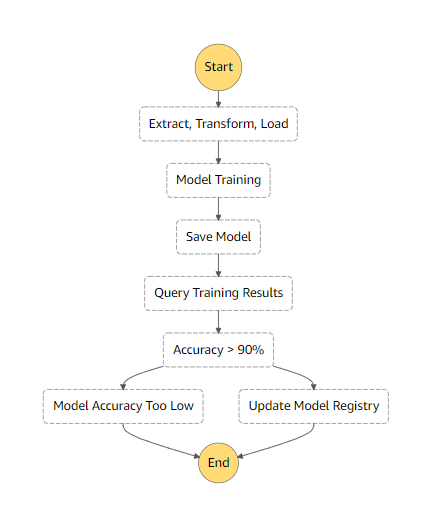
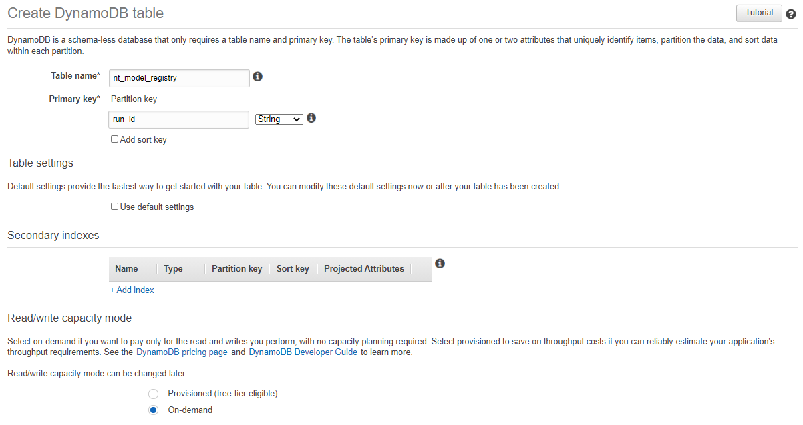
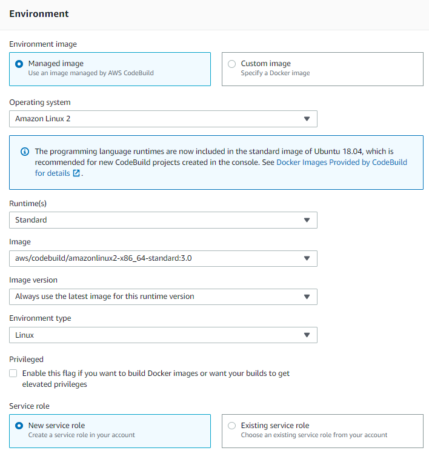
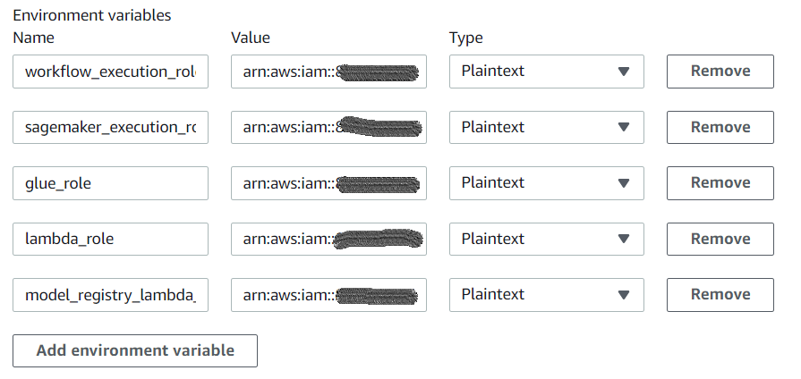
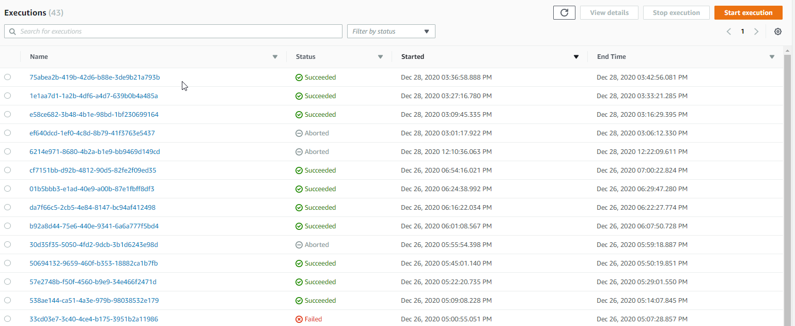
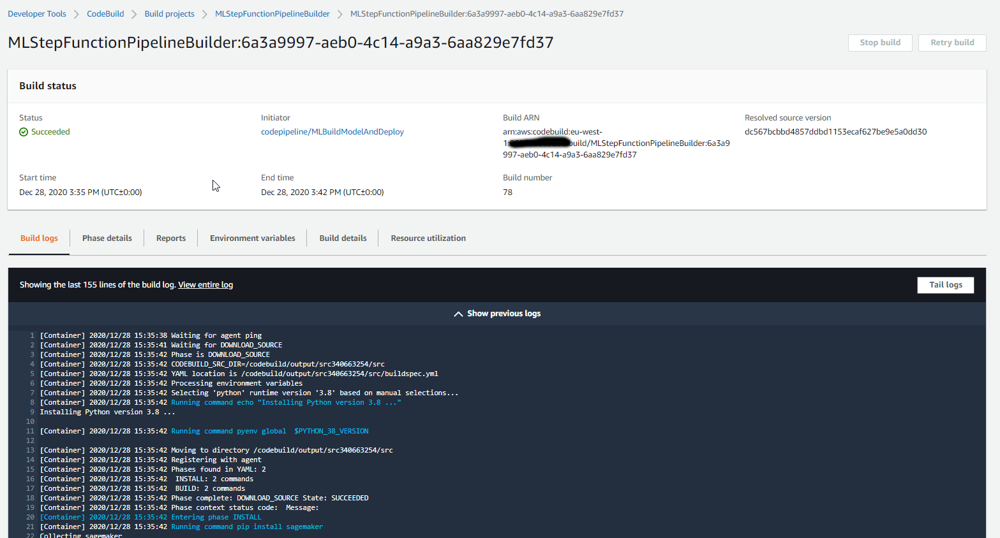
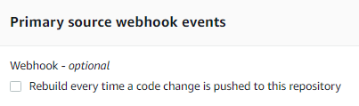
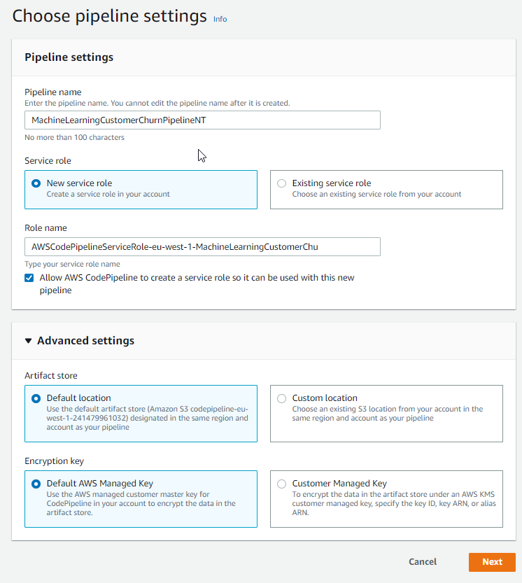
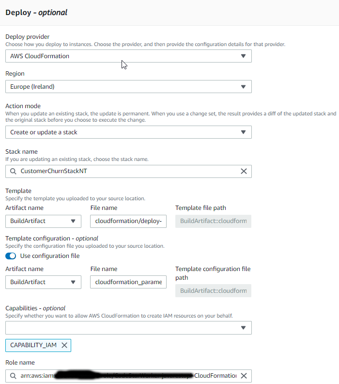

# Deploying a Customer Churn Algorithm that uses XGBoost

In this exercise, you will create a machine learning pipeline for a customer churn prediction ML algorithm. Our focus is not on the use of the algorithm itself, but rather how we might create an automated build and deployment pipeline for it.

The architecture for the pipeline is as follows:

1. A Python script is stored in a Git repository that will be used to update and then run a StepFunction pipeline that will:
   
   1. Perform an ETL on some customer churn data using Amazon Glue
   2. Train a Model using the XGBoost Sagemaker Algorithm.
   3. Save the Model
   4. Test the Model to ensure accuracy > 90% using a Lambda function
   5. Assuming accuracy is good, then update a DynamoDB database table with the latest build information

The Step Function diagram is shown below:



2. Prepare a set of CloudFormation parameters ready for a CodeDeploy step to then deploy the Endpoint into production.

The Step Functions could actually be used to complete the deployment, but since we want more control over our deployments with things such as versioning and the ability to rollback a deployment, we have used CloudFormation instead.

You will be completing all the of exercises in region EU-WEST-1. Please AVOID using US-EAST-1 completely as this has some production artifacts in it.


# Your Tasks
Broadly, you will need to complete the following tasks.

1. Get the project into your own Git repository.
2. Create a DynamoDB table to act as the Model registry.
3. Set up a CodeBuild Project that can build create and then run your StepFunctions.
4. Set up the necessary roles and permissions to allow the above to run successfully.
5. Review the Python script that sets everything up. A number of updates will be required such as naming of generated artifacts.
6. Set up the CodePipeline and CodeDeploy to run the Cloudformation template to deploy your application.


## 1. Get the Project into your own Git Repository

1. The repository URL for the example can be found here: https://github.com/nicktodd/machinelearning-train

2. Fork this repository into your own Git repository. Your repository needs to be GitHub or CodeCommit as these are supported by CodePipeline and CodeBuild. We suggest you use CodeCommit but either will work fine.


## 2. Create the DynamoDB table to maintain the model registry

1. Sign into the AWS Console and select the Ireland (eu-west-1) region.

2. Using the `AWS Web Console`, navigate to the `DynamoDB` service.

3. Create a Table called [YourInitials]_model_registry, for example `nt_model_registry`. Using a name with your initials in it will disambiguate it from anyone elses in the class. Set the `Primary key` to be a String called `run_id` (for each run of the pipeline). The other attributes will be created by the Python code, so you do not need to add them. Deselect the `Use Default Settings`, and set the `Read/Write Capacity Mode` to `On-demand`.



## 3. Create the CodeBuild Project

1. Using the `AWS Web Console`, navigate to the `CodeBuild` service.

2. Click `Create Build Project`. Set the name to be [YourInitials]-StepFunctionsBuild. for the Source, link the project to your Git repository that you created earlier in step 1.

3. For the Environment, this is where you select the Docker image that will be used to complete your build. We just need a standard Amazon Linux for x86 processors.



4. Select that you would like to create a Service role. 

5. For the Buildspec, you can use the default which is to use a buildspec.yml file in the root of the project. That file is already there.

6. The rest can be left as defaults, so you can simply select `Create build project`.

7. You will need to add some additional permissions to the generated CodeBuild role through a policy we have created for you. This will allow it to do the tasks it needs to do in order to run successfully. To do this, in your CodeBuild project, click on the `Build Details` tab, and then right click on the link to the `Service Role`, and click `Open in new Tab` or your browsers equivalent.

8. In the `Permissions` section that then appears, click `Attach Policies`.

9. In the `Filter Policies`, enter in the text `StepFunctionsWorkflowExecutionPolicy`. 


10. Select the located policy, and now search for S3FullAccess and attach that policy. Selct the located policy, and now search for LambdaFullAccess, and select the located policy. click `Attach Policy`.

You will now be setting up the permissions for the various components created by the build script.

## 4. Define the relevant IAM policies and roles

The build process for this pipeline is all determined by a Python script that creates and configures the various components, such as the Step Functions, the Lambda functions, the Glue Job and so on. 

Each of these components needs some permissions so a number of roles and the related policies need to be set up. It would be possible to set them up in the script, but then your build job will require access to the IAM service to be able to write policies and permissions. This would not always be allowed depending upon corporate policies. 

We will assume that this would not be allowed, so we would need to set up the relevant policies.

If the policies are already in existance, do we want to reference them directly in the build script? The names might change, and there is some debate about whether it is good practice to put role ARNs directly into souce control.

For this script, the policy names are passed into the CodeBuild project as environment variables, so we need to set those. There are five in total:

1. workflow_execution_role - run the step functions permission
2. sagemaker_execution_role - run sagemaker
3. glue_role - permissions for the glue job
4. lambda_role - permission to test the model
5. model_registry_lambda_role - permission to update the DynamoDB table

Each of these roles will require the appropriate policies. Luckily for you, they are in the Amazon account already! They have been given slightly wider permissions than you would normally give, but that is to ensure that the policies will work for all of you.

1. In your Build project, click Edit, and then click Environment.

2. Locate the Environment Variables section, and add the following variables:

| Variable Name | Variable Value |
|---------------|----------------|
| workflow_execution_role | arn:aws:iam::<ACC_NUMBER>:role/StepFunctionsWorkflowExecutionRole |
| sagemaker_execution_role | arn:aws:iam::<ACC_NUMBER>:role/AmazonSageMakerExecutionRole |
| glue_role | arn:aws:iam::<ACC_NUMBER>:role/AWS-Glue-S3-Bucket-Access |
| lambda_role | arn:aws:iam::<ACC_NUMBER>:role/query_training_status-role |
| model_registry_lambda_role | arn:aws:iam::<ACC_NUMBER>:role/ModelRegistryAccessRole |


When complete it will look something like this:



3. Once you have set them, click `Update Environment`.

## 5. Review and Amend the Python Script

1. Using your preferred code editor, open the file `create-step-functions.py`.

2. Have a high level read through of the code. The code is written in a linear fashion to make it easier to review and understand. In a real scenario, you would want to break it down into separate functions and classes.

You might be more familiar with Jupyter notebooks. It is possible to run a notebook from the terminal, or alternatively, convert the notebook into a script. Check out this Stackoverflow post if you are interested: https://stackoverflow.com/questions/35545402/how-to-run-an-ipynb-jupyter-notebook-from-terminal


### Update some Resource Names

Let's now make the required changes. First off, locate the various resource names declared around line 27.

```
job_name = 'glue-customer-churn-etl-c020134fb5334562bb3c31e6d02cc77d'
function_name = 'arn:aws:lambda:eu-west-1:' + account_id + ':function:query-training-status-c020134fb5334562bb3c31e6d02cc77d'
workflow_name = 'MyInferenceRoutine_c020134fb5334562bb3c31e6d02cc77d'
```
1. Rename these values so that instead of the c02... unique id on the end of the name, replace it with your initials. For example, 

```
job_name = 'glue-customer-churn-etl-c020134fb5334562bb3c31e6d02cc77d'
```

Could become:

```
job_name = 'glue-customer-churn-etl-nt'
```

These names will provide uniqueness between other students, and also will make it easier to identify your resources in the shared AWS account.

2. Now locate the `training_job_name`, `project_name` and `model_name` variables, and add your initials into the values for those as well (around line 35-38):

```
training_job_name = "CustomerChurnTrainingJob-nt" + dateAsString
```
### Review the Glue Job Creation

The script will be used to create the Glue job for the ETL. The job is not run from here, but simply created. It will be run as part of the Step Function flow. 

1. Note that to create a Glue Job, the create_job function is used. To update a job, the update_job function is used. You can see the try/except block to handle both first run and subsequent runs.

We made the design decision to update the existing job rather than delete the old one because then you can see the history of all of the job runs in Glue. If you delete and recreate it then you will lose the information.

Unfortunately, there is no create or update function, so you have to use one or the other.

2. Note also that the job is uploading a simple CSV. In a real scenario, the data could be in a feature store, or some kind of data lake in S3. 

Changes to this data would be a good reason to rerun the pipeline. You may also make changes to the Glue job in response to changes in your data, or in the way you want to process it.

3. To see how the Glue job works, you can open the file code\glue_etl.py. Glue is beyond the scope of the training, but you can see from the script that it is using Spark. 

### Review the Two Lambda Function Deployments

1. Review the two Lambda functions. The code is found in code\query_training_status.py and code\update_model_registry.py.

2. You will need to make a change to the Model Registry updater. Locate line 12 where it sets the table name. You must amend this to refer to the name of the table you created in the earlier part of the exercise.

In a real scenario, you would probably have this as a shared Lambda that updates a centralised DynamoDB table. We are having you do it in your own tables so you can see what is involved.

3. Return to the create-step-functions.py script, and review the code from around line 92. This code is used to deploy the Lambda functions. Again note that it does not run them. This will be done by the Step Functions. Note too that we are removing and then recreating the Lambdas each time. We could have deployed new versions. But as with Glue, there is no create or update function. 

4. Locate the line that sets the registry_function_name. Amend the name to include your initials on the end.

```
registry_function_name = "ModelRegistryUpdater"
```

### Review the Estimator

Locate line 164 or thereabouts where the Estimator is created. This is configured with the various hyperparameters and instance type etc. 

In a real scenario, this is where you are likely to be making changes to these parameters resulting in rerunning the pipeline.

No changes are required here.

### Review the Step Function Step Creation

From around line 184 we are now focused on creating the flow for the Step Functions. The execution_input variable represents the parameters passed into the step functions when they are launched.

```
execution_input = ExecutionInput(schema={
    'TrainingJobName': str,
    'ModelName': str,
 })
```
Now review each step being created in the code and compare it with the steps in the diagram. You will see each step is created one by one.


They are still however, to be chained together. That happens next.

### Review the Chaining of the Steps

The Steps are chained together using the chain() function. You can see this around line 280.

```
workflow_definition = steps.Chain([
    etl_step,
    training_step,
    model_step,
    lambda_step,
    check_accuracy_step
])
```

### Deploy the StepFunctions

Just like our Glue job, we are updating an existing Step Function flow so that we can preserve our history of executions.



If we simply recreated the job, we would lose all of our execution history.

In this case, we have provided the code to create the Step Function for the first time. It is commented out on line 


1. Just like with the Glue job, since the step functions have not been deployed before, you will need to uncomment the block that creates a new StepFunction and comment out the block that updates it.

```
workflow = Workflow(
    name=workflow_name,
    definition=workflow_definition,
    role=workflow_execution_role,
    execution_input=execution_input
)
```
### Run the Step Function Flow

We can now run the Step Function job which will trigger the glue job, the machine learning, and the Lambdas. 

Note line 312 where we invoke execute(). Note we pass in a name for the execution, and then also the name we want the Model to have when it gets created by the StepFunction. 

One thing to point out here is the sleep() call. That is there since if you update a step function and then immediately invoke it, you end up running the old version - very confusing!

### Set up the Parameters For a CloudFormation Deployment

It would be possible to deploy the machine learning endpoint using the Step functions. The original example from AWS does actually do that. 

However, we want to separate Model creation from Deployment, and in our example, we have selected to use CloudFormation for the deployment. Therefore, we can create the required parameters for any CloudFormation deployment template.

CloudFormation is a standard way to deploy applications on AWS, and the benefit of using this is that you can integrate your deployments with wider application deployments, and it gives you significant control over the deployment.

1. Open the file `cloudformation/deploy-model.yml`. This is our CloudFormation template. The important sections are `Parameters` and `Resources`. 

2. First review the `Parameters` section at the top. It needs to know which Model to deploy, which container to run it on, then the instance type and the how many you would like. Finally it wants to know the role that the endpoint should be run with.  

3. Now review the `Resources` section. There are only two. The `EndpointConfiguration` and the `Endpoint`. 

4. Now return to `create-step-functions.py`. The CodeDeploy service requires a JSON structure containing the parameters in order to run CloudFormation. The structure is:

```
{
  "Parameters" : {
      "ModelName" : model_name,
      "ModelDataUrl" : model_data_url,
      "TrainingImage": container,
      "InstanceType" : "ml.t2.xlarge",
      "InstanceCount": "1",
      "RoleArn": sagemaker_execution_role
  }
}
```

Locate line 523 where you will see a variable set up with that same structure.

This is then saved into a file called `cloudformation_parameters.json` on line 348. Note also that we are waiting for the step function execution to complete. 
 
So how does this file end up with the CodeDeploy service?

5. Open buildspec.yml again, and notice the final section. It is called `artifacts`. The parameters file is referenced here as an artifact. This makes it available to subsequent steps in the pipeline.

If you do not add this entry, when you try and reference the file from CodeDeploy, you will get an S3 permission error with no reference to what the request was asking for. It can take a long time to debug....

## Check in your Code and See if it Builds

1. Make sure you have saved all your code changes.

2. In the AWS Console, ensure that you are on the Web page about your CodeBuild project.

3. Now commit and push your changes to Git (git commit and then git push).

This will trigger CodeBuild to try and run your build for you.

4. Return to the AWS Web console, and you can see the progress of your CodeBuild project.



5. If everything appears to be working, you can browse to to the StepFunctions service as well and see if your new Step Functions are there, and also if it is running.

## TroubleShooting

If it has not worked. Check the error message in the build log which will give you a big clue as to the problem.

### Permissions
Most problems will be around permissions. You may need to add in some permissions to your policies.

### Glue Job
Sometimes the Glue job can hang and needs to be terminated. It should not take longer than 2 minutes to run. If it seems to be running indefinitely, terminate the Glue Job in the Glue Console and try running your CodeBuild again.

## 6. Set up CodePipeline and CodeDeploy

1. First, if you are using GitHub, you will want to stop the CodeBuild triggering on every Git commit. If you leave it in place, your CodeBuild project will run twice on every commit! This can be done in the CodeBuild project `Source` settings.



2. Save the update to the configuration and now head over to the `CodePipeline` service.

Pipelines can be created through the Web console, or alternatively you can create a JSON file describing the pipeline and then deploying the pipeline using the aws cli.

You will create the Pipeline visually using the AWS Web Console.

3. Click the `Create Pipeline` button.

4. Provide a name of your new Pipeline. We suggest placing your initials in the name to disambiguate it from everyone elses. The rest can be left as the defaults.



5. Click `Next`, and then at the Source Provider screen, link it to your Git repository like you did in the CodeBuild project.

Note the option for the Output artifact format. You have a choice of either a zip of the code, or a full Git clone. If you wish to access Git attributes such as the Commit ID or any other Git attributes, then you will need to select Git clone. For the purposes of what we are doing, the default is sufficient.


6. Click `Next`. At the Build step option, choose CodeBuild and then in the appearing drop down, select your existing CodeBuild project, and then click `Next`.

7. At the `Add Deploy Stage` screen, at the `Deploy provider` box, select `CloudFormation`.

8. At the `Action mode`, select `Create or Update`.

9. Set the `Stack name` to `CustomerChurnStack[YourInitials]`.

10. For the `Template` set it to be a `Build artifact` and set the name to be `cloudformation/deploy-model.yml`

Note we will have to change this later. It is actually a source artifact, but the option is not there to set it yet.

11. For the `Template configuration`, you will be using your JSON file generated from the CodeBuild project, so enable the toggle and then set the filename to be a `Build artifact` called `cloudformation_parameters.json`.

12. For the `Capabilities`, select `CAPABILITY_IAM`. This allows CloudFormation to make role changes.

13. For the Role name, you will need to select a Role that has permissions relating to CloudFormation  and also SageMakerFullAccess. You may well need to create one with those permissions. 

A summary of the options is shown below:



14. Click `Next`, and then click `Create Pipeline`.

15. It will immediately try and run the Pipeline, which we don't really want, so wait until the source stage has completed and then click `Stop execution`.

16. It will then prompt for which build to stop. Select your build from the list and then stop it.

17. We need to edit the cloudformation template to come from the source code, so at the top of the page, click `Edit` and scroll down to the Deploy stage and click `Edit Stage`.

18. In the `Deploy` action, click the grey popout button (not the blue one as this opens CloudFormation!).

19. In the `Edit action` dialog, locate the `Input artifacts` section and click the `Add` button.

20. Select the `SourceArtifact` from the dropdown. This is what was missing when we went through the wizard earlier.

21. Locate the `Template` section, and change the `Artifact name` to `Source artifact`.

22. Click `Done`, and then click `Save`.

23. That's it done! So now click `Release change` to run your pipeline.


## Troubleshooting

If there are errors, review the error messages either in the CodeBuild log, or in the CodePipeline log if the CodeBuild has worked correctly.

The CodeDeploy error messages are not always that helpful unfortunately, but the most likely cause or errors will be mistakes in your filenames for the Cloudformation template and parameters files, and ensuring that you have the correct permissions in place.

Using the Web console, go to the CloudFormation service and locate your pipeline. If it is not there, then CodeDeploy didn't even get as far as trying to deploy it. If it is there, if it worked it will be there as `CREATE_COMPLETE` in green, or if not, then it will be there in red as `ROLLBACK_COMPLETE`.

IMPORTANT: If it is set on `ROLLBACK_COMPLETE`, you will have to delete the Cloudformation stack before you can run the pipeline again.


If you are unsure about your template, try deploying it directly through the Cloudformation service. You will have to pass in the various parameters in the Web console but it will work correctly. That can be a useful way to check whether you have a problem with the template or its parameters or with the CodeDeploy itself.