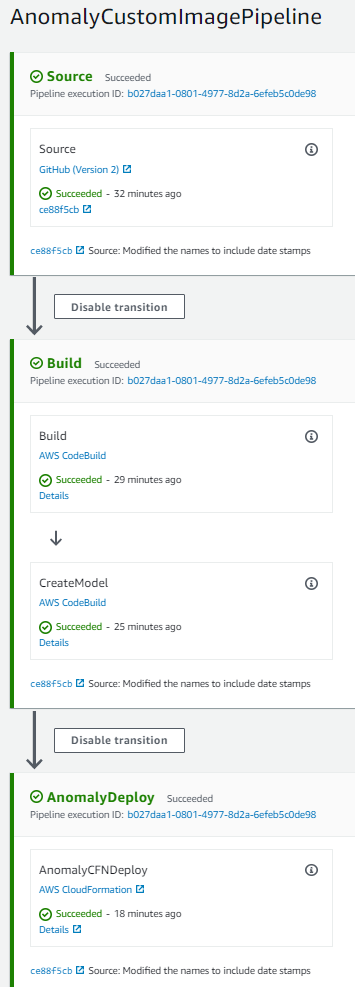
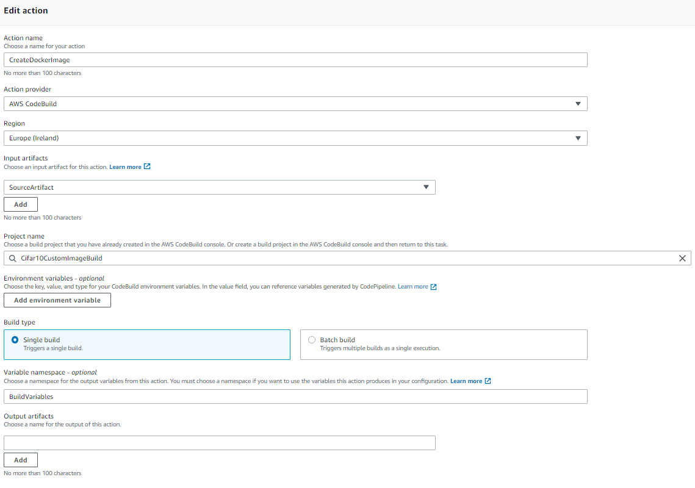
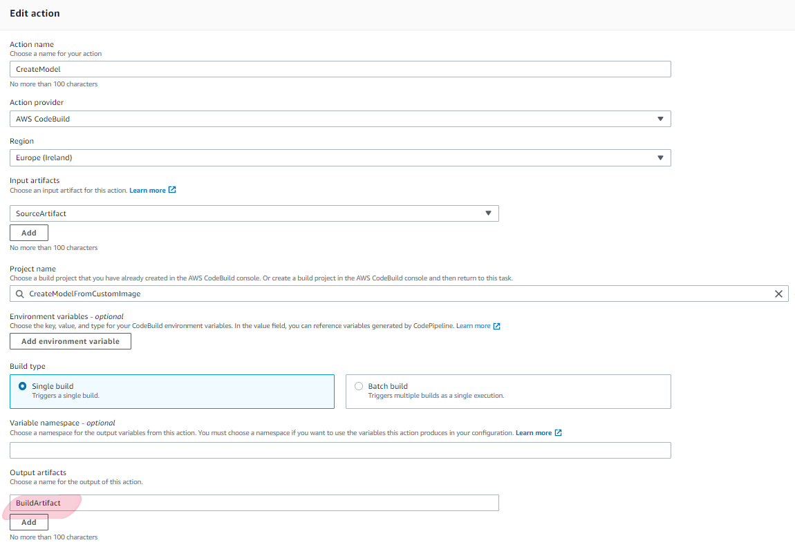
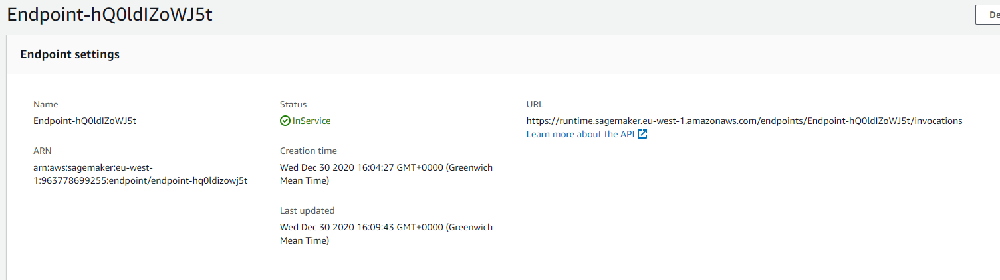
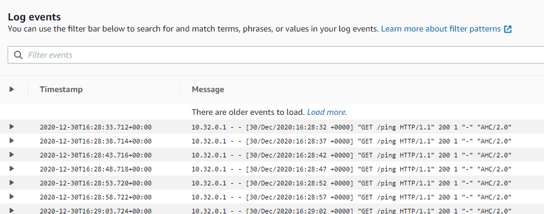

# Deploying a Pipeline for a Model that uses a Custom Docker Image

In this exercise, you will create a machine learning pipeline for a  ML algorithm pipeline where a custom Docker image is now required. We are not using one of the standard Sagemaker images, but rather our own.

This pipeline is much simpler than our Customer Churn Step Function pipeline, as we want to focus in this example, on how a Docker image is created as part of a pipeline.

It could easily be extended to add in more steps if required.

We are also in this model introducing multiple CodeBuild steps.

Just like in the previous exercise, your challenge is to get this pipeline working for yourself!


# Your Tasks
Broadly, you will need to complete the following tasks.

1. Get the project into your own Git repository.
2. Set up a CodeBuild Project that will build your Docker image for you.
3. Set up a CodeBuild Project that will build the Model. 
4. Set up the necessary roles and permissions to allow the above to run successfully.
5. Review the Python script that sets everything up. Just like before, a number of updates will be required.
6. Set up the CodePipeline and CodeDeploy to run the Cloudformation template to deploy your application.


## 1. Get the Project into your own Git Repository

1. The repository URL for the example can be found here: https://github.com/nicktodd/custom-image-anomaly

2. Fork this repository into your own Git repository. Your repository needs to be GitHub or CodeCommit as these are supported by CodePipeline and CodeBuild. We suggest you use GitHub since you will be able to authenticate more easily due to company restrictions on Code Commit.


## 2. Review the buildspec.yml, Dockerfile, and ML Script

1. Using your preferred editor, open the `buildspec.yml` file in your new Git project.

2.  Note the various sections. In the first section, we are logging into the Docker registry for our own ECR registry. The parent image is a Ubuntu standard image in Dockerhub.

```
  pre_build:
    commands:
      - echo Logging in to Amazon ECR...
      - aws ecr get-login-password --region eu-west-1 | docker login --username AWS --password-stdin xxx.dkr.ecr.eu-west-1.amazonaws.com 
```

3. Review the commands in the build section. We are building a Docker image from the Dockerfile. In this section, update the account number for your AWS account number.

```
 build:
    commands:
      - account=$(aws sts get-caller-identity --query Account --output text)      
      - docker build -t anomalyimage:latest .
      - docker tag anomalyimage:latest ${account}.dkr.ecr.eu-west-1.amazonaws.com/anomalyimage:latest
```

4. You must change the image name in the file to be something unique to you. You could simply add your initials on the end of the image name and tag. In simple terms, change every reference to `anomalyimage` to something else, eg. `anomalyimage-nt`.

Note the commands we are using to obtain our account ID. The service being used is the Secure Token Service, STS.

4. Now review the post_build phase. In there we are pushing our image up to the Elastic Container Registry ECR.

```
post_build:
    commands:
      - docker push ${account}.dkr.ecr.eu-west-1.amazonaws.com/anomalyimage:latest
```
5. You will also need to change the name here from `anomalyimage` to your new name. So make the change now and save the file.

6. Now open the Dockerfile. We don't need to spend a long time on this, but review the core sections. You can see that the parent image is a basic Ubuntu image! Nothing will be available, so in our RUN commands we are installing both Python and also the required Python libraries and various other required libraries. In addition, we are copying over the ML code into the image and giving it write permissions.

Note the presence of two files particularly:

* anomaly-model/train
* anomaly-model/serve

These are the two files that SageMaker will use when it runs the model. To do training, SageMaker runs `docker run image-name train` and when used for predictions it uses `docker run image-name serve`. 

If you are interested in the Algorithm and how it works, feel free to explore the various files located in the `anomaly-model` directory.


## 3. Set up the CodeBuild Project

6. Using the `AWS Web Console`, navigate to the `CodeBuild` service.

7. Click `Create Build Project`. Set the name to be `[YourInitials]-AnomalyImageBuild`. For the Source, link the project to your Git repository that you created earlier in step 1.

8. For the Environment, this is where you select the Docker image that will be used to complete your build. We just need a standard Amazon Linux for x86 processors.

9. Select that you would like to create a Service role.

10. In the `Privileged` section, tick the option to enable elavated privileges since we do want to build a Docker image. 

11. For the Buildspec, you can use the default which is to use a buildspec.yml file in the root of the project. That file is already there.

12. The rest can be left as defaults, so you can simply select `Create build project`.

13. Finally, in the AWS Web Console, head over the Elastic Container Registry service and create a `Repository` with the same name as your image, eg. `anomalyimage-nt`. Use all the default settings when you create it.

## 4. Define the relevant IAM policies and roles

1. Navigate to IAM and locate the role that you just created, and add the following additional policy - `DockerCodeBuildPolicy`. It has been created for you and will privde necessary access to ECR. Specifically it needs to be able to push images and get the login password.

The policy is located in[iam_policy_examples/docker_image_codebuild.json](iam_policy_examples/docker_image_codebuild.json) if you would like to see it.


## 5. Run the CodeBuild Project

1. Commit and push your changes to Git, and if you are using GitHub this will trigger your build. If you are using CodeCommit, manually start a build. Check that succeeds. If y

2. If it works, you will see a new image in your ECR repository. YOu can find it by navigating to the Elastic Container Registry it in the Amazon Web Console.

3. If it fails, check the error log. The chances are you have either got your repository name wrong or you have not added the relevant permissions to your CodeBuild IAM role policy.

## Create a Second CodeBuild Project to complete the Machine Learning

So you now have a CodeBuild step that will create the Docker image. What we will now do is create another CodeBuild step that will do the machine learning. It could be done all in one, but this separation gives us more flexibility when running our actions.

1. Create a new CodeBuild project called `CreateAnomalyModel[YourInitials]`.

2. Go through the steps linking it to your Source repository as before, and then for the buildspec file specify a different name this time, as the buildspec is now called `buildspec-model.yml`.

3. In your preferred code editor, open `buildspec-model.yml`. In this example, we are not using Step Functions (although we could if wanted to), but rather we are simply creating the model using the SageMaker API. 

4. Locate the Role name variable in line 10 and replace it with your AmazonSagemaker execution role (there is probably one already in your account).

5. On line 17, update the prefix variable to also include your initials just before the date stamp. eg:

```
prefix = 'anomaly-ml-image-nt' + dateAsString
```

6. On line 24, replace the image name with your chosen image name from your build step from earlier on.

You will see that an Estimator is created in order for us to do the Machine Learning. As it happens, this particular algorithm doesn't really need to do any learning, so actually not much is happening here! However, SageMaker requires a Model to be created so we have to do something. If you are interested, you can review the anomaly-model/train Python script to see what is actually happening.

You will also note that it creates a parameter file, similar to the previous example ready for deployment by Cloudformation.

7. Commit your changes to Git, and review the project execution in CodeBuild. Fix any errors before proceeding.

## Create the CodePipeline along with the CloudFormation CodeDeploy step.

The process is much the same as the previous Customer Church example. However our build step will involve two Code Builds instead of one.

The pipeline should look like the below:



You can set this pipeline up for yourself using your experience from the previous pipeline to remind you how to do it. We recommend using the Create Pipeline wizard as it is the least painless option. A few things to bear in mind:

1. You will have to go back into the pipeline to amend the Cloudformation parameter location as you did in the previous exercise as the BuildArtifact option will be missing.

2. You will also have to add in the second Action Group after the pipeline has been created. Since when you use the wizard it assumes only one build step, but you will have two.

3. Below is a screen shot of the configuration for your CodeBuild for the Docker image:



4. You must ensure that you add a name to the BuildArtifact of the second Action that building the model, otherwise the CloudFormation template will not get the parameter file made available to it. The tell tail error is rather vague S3 bucket request error. A sample screenshot for your second CodeBuild is shown below:




5. You can now try running the pipeline. 
  

## Reviewing the Deployment

1. Using the AWS Web Console, navigate to the SageMaker service, and then click on the Endpoints link on the left.

2. Locate your endpoint in the list and select it.

3. You will see your Endpoint is `In Service`.



4. Scroll down and you will see the graphs. Locate the link to `View Logs`and click it.

5. Select the link to the `log stream`. You will see all the health checks returning a healthy HTTP 200 response.




## Troubleshooting

If there are errors, review the error messages either in the CodeBuild log, or in the CodePipeline log if the CodeBuild has worked correctly.

The CodeDeploy error messages are not always that helpful unfortunately, but the most likely cause or errors will be mistakes in your filenames for the Cloudformation template and parameters files, and ensuring that you have the correct permissions in place.

Using the Web console, go to the CloudFormation service and locate your pipeline. If it is not there, then CodeDeploy didn't even get as far as trying to deploy it. If it is there, if it worked it will be there as `CREATE_COMPLETE` in green, or if not, then it will be there in red as `ROLLBACK_COMPLETE`.

If you are unsure about your template, try deploying it directly through the Cloudformation service. You will have to pass in the various parameters in the Web console but it will work correctly. That can be a useful way to check whether you have a problem with the template or its parameters or with the CodeDeploy itself.