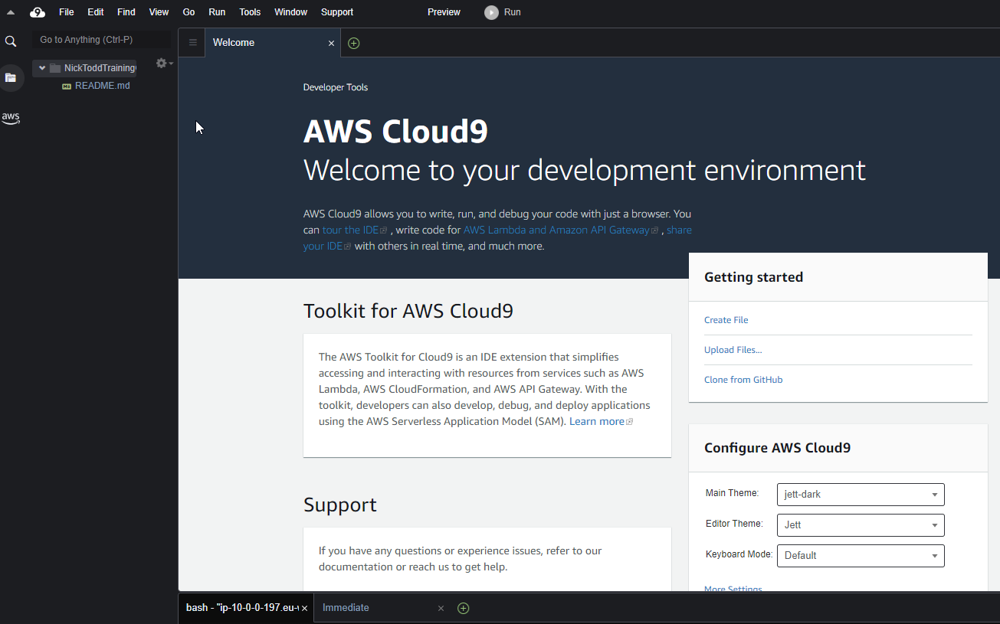
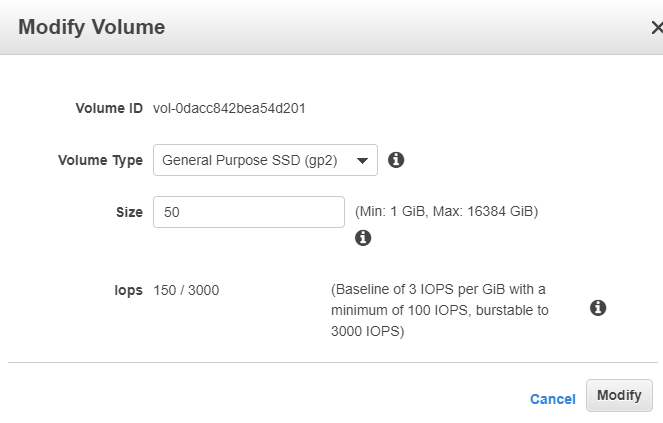

# Setting up Cloud9 

CLoud9 is the AWS development environment that integrates with CodeCommit, Lambda, and many other AWS services.

It comes preinstalled with Git, the AWS CLI, Docker, SAM, and various other useful tools, and you can install others, since it is fundamentally a Linux EC2 with a Web based IDE installed in it.

You might want to use this for the exercises.

## Setting up Cloud9 for the Exercises

1. Browse to the Cloud9 service and set up a Cloud9 environment. For the training, for the instance type, either a t2.medium or a l3.large will be about right (you need enough RAM to run Docker containers).

Once the environment has been created. You will be able to access it via a Web browser. However, it only has 10GB Disk space which is not enough, so it has to be ameneded afterwards (which is a bit annoying).

2. Using the Amazon Console, navigae to the EC2 service and then locate Elastic Block Store / Volumes on the left hand menu.

3. Once your Cloud9 has launched there will be a new 10GB volume present. Right click on the volume and select Modify Volume. Change the disk size to 50gb or something like that.

4. Confirm the change, and now we need to restart the instance, so click on Instances in the left pane, and then locate your Cloud9 machine, right click on it, and choose Reboot instance.

5. Return to your Cloud9 IDE interface and once it has rebooted you will now have enough disk space for the Docker images to be downloaded as and when you need them.